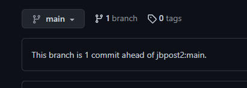
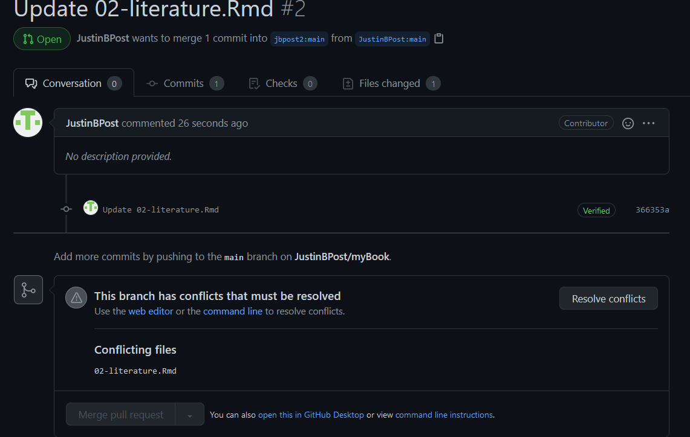

```{r setup, include=FALSE,warning=FALSE,message=FALSE}
options(htmltools.dir.version = FALSE)
knitr::opts_chunk$set(
  message = FALSE,
  warning = FALSE,
  dev = "svg",
  fig.align = "center",
  #fig.width = 11,
  #fig.height = 5
  cache = FALSE
)

# define vars
om = par("mar")
lowtop = c(om[1],om[2],0.1,om[4])
library(tidyverse)
library(knitr)
library(reticulate)
options(dplyr.print_min = 5)

#Control Flow: If/Then/Else
#Iterators and Loops
#Numpy Arrays
#Pandas Data Frames
#Writing Functions
#Summarizing with Scipy and Matplotlib
```


# What do we want to be able to do?

Data Science!

- Read in raw data and manipulate it
- Combine data sources
- Summarize data to glean insights
- Apply common analysis methods
- Communicate Effectively

---

# Workflow

Important considerations for data analysis workflow: 

- **Reproducibility**  
<br>
<br>
<br>
  
- **Version control**  
<br>
<br>
<br>
  
  
- **Collaboration**  
  

---

# What are git and github?

- **Git** is a version control software  
  
- **Github** is an online hosting service for Git-based projects


---

# What are git and github?

- **Git** is a version control software  
  
- **Github** is an online hosting service for Git-based projects

## Git Tracking

- You associate git with a folder (repo)

- Git keeps track of all files in the folder (repo)

- If you want to keep changes you've made, you **commit** and **push** the changes to the folder (repo)


---

# Github

- Github allows you to have a remote file repository (folder) tracked by git

    + Let's create a repository on github.com 

    + **Add** some files and **commit** to the changes
    
    + Modify some files on github
    
    + Investigate the version control!


---

# Local vs Remote Work

Mostly you'll want to work on your local computer.  Install `git` on your computer!


---

# Local vs Remote Work

Mostly you'll want to work on your local computer.  Install `git` on your computer!

## Workflow

1. (Initially) **clone** the repo locally.  (Later) **pull** to get most recent versions of files

2. Work and make changes

3. **add** and **commit** to changes you like

4. **push** changes to remote repo (on github)

Let's clone our repo and work on it locally!


---

# Git & RStudio

Git and RStudio work great together!

- Works through **R Projects**
<br>
<br>
<br>

- Start a new project from git repo

    + Update with command line or git menu!

---

# Collaboration Idea

- Everyone can work on the same `branch` and just take turns working

```{r, echo = FALSE, fig.align='center', out.width = "500px"}
knitr::include_graphics("img/git_diagram.png")
```


---

# Working on Branches

- Alternatively, you can have separate **branches** of the repo

```{r, echo = FALSE, fig.align='center', out.width = "500px"}
knitr::include_graphics("img/git_branch_diagram.png")
```

- Work on a branch is similar to working on the main branch

- Can merge when happy!


---

# Forking

- People often `fork` the repo 

- This creates a copy of the repo on your account

- You can then work as normal

- If you do a commit on your branch, you may notice something like this

```{r, fig.align='center', out.width="45%", echo = FALSE}

```


---


# Merging Branches

Suppose you like your commit and you think the original owner will too!  

- You can do a `pull` request  

```{r, fig.align='center', out.width="79%", echo = FALSE}
knitr::include_graphics("img/pullrequest.png")
```


---

# Merging Branches

Suppose you like your commit and you think the original owner will too!  

- You can do a `pull` request  

```{r, fig.align='center', out.width="75%", echo = FALSE}
knitr::include_graphics("img/pullinfo.png")
```


---

# Merging Branches

If you are lucky, there won't be any merge conflicts.  

- Allows the owner of the original repo to accept the pull request without needing to modify things

- The owner will get a notification that a pull request has been made

```{r, fig.align='center', out.width="45%", echo = FALSE}
knitr::include_graphics("img/pullrequestnoted.png")
```


---

# Merging Branches

Owner can then investigate the request and choose whether or not to accept it or they can ask for more details

```{r, fig.align='center', out.width="70%", echo = FALSE}
knitr::include_graphics("img/pullcheck2.png")
```

---

# Dealing with conflicts 

- Sometimes changes requested conflict with changes already made  

```{r, fig.align='center', out.width="70%", echo = FALSE}
knitr::include_graphics("img/mergeconflict.png")
```


---

# Dealing with conflicts 

Owner sees a notification about conflicts that must be resolved  

```{r, fig.align='center', out.width="70%", echo = FALSE}

```


---

# Dealing with conflicts 

They can view the issues and pick which to include or to include both with a modification  

`<<<<<<<` is a conflict marker  

```{r, fig.align='center', out.width="70%", echo = FALSE}
knitr::include_graphics("img/resolve2.png")
```

- Figure out what to do and delete the `<<< === >>>` lines  


---

# Recap

- **Git** is a version control software  

    + Associated with a folder (repo)
    + Tracks changes to files

- **Github** is an online hosting service for Git-based projects

- Workflow:

    + Pull down most recent files (`git pull`) or do initial download (`git clone`)
    + Add files you want to keep changes to (`git add`)
    + Commit to the changes (`git commit`) 
    + Push the changes to the remote repo (`git push`)
