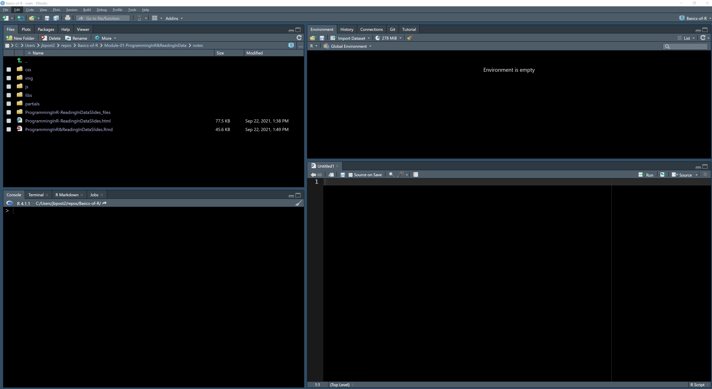

layout: true

<div class="my-footer"></div> 

---

# Our Tasks as a Data Scientist

-   Read raw data in or connect to a database
-   Manipulate data as need
    -   Subset
    -   Create new variables
-   Summarize data to create meaningful insights
-   Modeling data to make inference or predict outcomes
-   Communicate our results via dashboards, documents, model files, etc.

R is a great language for all of these!

---

# R vs RStudio

- R is our programming language

- Code in R through RStudio

<div style = "float: left; width: 45%">
```{r, out.width='20%', echo = FALSE}

```
</div>
<div style = "float: left; width: 45%">
```{r, out.width='20%', echo = FALSE}
knitr::include_graphics("img/RStudio.png")
```
</div>

---

# RStudio IDE

In RStudio, four main locations

-   Console (& Terminal)

-   Scripting and Viewing Window

-   Files/Plots/Packages/Help

-   Environment (& Connections/Git)

```{r, out.width="450px", echo = FALSE }

```

---

#  Console  

- Type code directly into the **console** for evaluation  

<div style = "float:left; width = 45%;">
```{r calc2, echo=TRUE}
#simple math operations
# <-- is a comment - code not evaluated
3 + 7
10 * exp(3) #exp is exponential function
log(pi^2) #log is natural log by default
```
</div>
<div style = "float: left; width = 10%;">
&nbsp;&nbsp;&nbsp;&nbsp;&nbsp;&nbsp;&nbsp;&nbsp;&nbsp;&nbsp;&nbsp;&nbsp;&nbsp;&nbsp;&nbsp;&nbsp;&nbsp;&nbsp;&nbsp;&nbsp;&nbsp;&nbsp;
</div>
<div style = "float:left; width = 45%;">
```{r basic, echo = TRUE, out.width = "250px", fig.align='center'}
mean(cars$speed)
hist(cars$speed)
```
</div>
<!--Needed so the above renders correctly.  Why, who knows? -->

---

# Scripting and Viewing Window

-   Usually want to keep code for later use!

-   Write code in a 'script' and save script (or use markdown/quarto!)

---

# Scripting and Viewing Window

-   Usually want to keep code for later use!

-   Write code in a 'script' and save script (or use markdown!)

-   From script can send code to console via:

    <ul>

    <li>"Run" button (runs current line)</li>

    <li>CTRL+Enter (PC) or Command+Enter (MAC)</li>

    <li>Highlight section and do above</li>

    </ul>


---

# Files/Plots/Packages/Help

-   Files (navigate through files)

-   Created plots stored in `Plots` tab

    -   Cycle through past plots\
    -   Easily save

-   Packages (update and install)

-   Documentation within RStudio via `help(...)`

    -   Ex: `help(seq)`

---

# Environment

-   We store **data/info/function/etc.** in R objects

-   Create an R object via `<-` (recommended) or `=`

```{r save,echo=TRUE}
#save for later
avg <- (5 + 7 + 6) / 3
#call avg object
avg
#strings (text) can be saved as well
words <- c("Hello there!", "How are you?")
words
```

---

# Environment

-   Built-in objects exist like `letters` and `cars` don't show automatically

```{r builtin, echo = TRUE}
letters
head(cars, n = 3)
```

-   `data()` shows available built-in data sets

---

# RStudio IDE

In RStudio, four main locations

-   Console (& Terminal)

-   Scripting and Viewing Window

-   Files/Plots/Packages/Help

-   Environment (& Connections/Git)

```{r, out.width="450px", echo = FALSE }

```

---

# R Objects and Classes

How do we program in R? Using **objects** and **functions**

-   R has strong **O**bject **O**riented **P**rogramming (OOP) tools


---

# R Objects and Classes

How do we program in R? Using **objects** and **functions**

-   R has strong **O**bject **O**riented **P**rogramming (OOP) tools

-   Object: data structure with attributes (often a 'class')

-   Method: procedures (often 'functions') act on object based on attributes

---

# R Objects and Classes

Object: data structure with attributes (often a 'class')

Method: procedures (often 'functions') act on object based on attributes

-   R functions like `plot()` act differently depending on object class

```{r echo = TRUE}
class(cars)
class(exp)
```

---

# R Objects and Classes

Object: data structure with attributes (often a 'class')

Method: procedures (often 'functions') act on object based on attributes

-   R functions like `plot()` act differently depending on object class

```{r eval = FALSE, echo = TRUE}
plot(cars)
plot(exp)
```
<div style = "float: left; width = 45%;">
```{r plot1, echo = FALSE, fig.align = 'center', out.width = '220px'}
plot(cars)
```
</div>
<div style = "float: left; width = 10%;">
&nbsp;&nbsp;&nbsp;&nbsp;&nbsp;&nbsp;&nbsp;&nbsp;&nbsp;&nbsp;&nbsp;&nbsp;&nbsp;&nbsp;&nbsp;&nbsp;&nbsp;&nbsp;&nbsp;&nbsp;&nbsp;&nbsp;
</div>
<div style = "float: left; width = 45%;">
```{r plot2, echo = FALSE, fig.align = 'center', out.width = '220px'}
plot(exp)
```
</div>


---

# R Objects and Classes

-   Create an R object via `<-` (recommended) or `=`

    -   allocates memory to object

```{r , echo = TRUE}
vec <- c(1, 4, 10)
vec
```

---

# R Objects and Classes

-   Create an R object via `<-` (recommended) or `=`

    -   allocates memory to object

```{r , echo = TRUE}
fit <- lm(dist ~ speed, data = cars)
fit
```

---

# R Objects and Classes

-   Function that creates the object determines the object's class

```{r , echo = TRUE}
class(vec)
summary(vec)
```

---

# R Objects and Classes

-   Function that creates the object determines the object's class

```{r , echo = TRUE}
class(fit)
summary(fit)
```

---

# Investigating Objects

Many functions to help understand an R Object

-   `class()`

-   describes the `class` attribute of an R object

```{r obj2, echo = TRUE}
class(cars)
class(vec)
```

---

# Investigating Objects

Many functions to help understand an R Object

-   `typeof()`

-   determines the (R internal) type or storage mode of any object

```{r obj3, echo = TRUE}
typeof(cars)
typeof(vec)
```

---

# Investigating Objects

Many functions to help understand an R Object

-   `str()`

-   compactly displays the internal structure of an R object

```{r obj1, echo = TRUE}
str(cars)
str(vec)
```

---

# To R!

Quick example

-   Customize the appearance of RStudio

-   Check out the `help()` functionality

-   Create object(s) and inspect them

---

# Recap!

-   RStudio provides a nice environment for coding

-   R has functions that can be used to create objects

    -   Create an R Object with `<-`

-   Objects have attributes that determine how functions act!

    -   `class()`, `typeof()`, and `str()` help understand your objects
