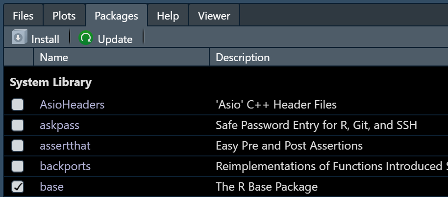

layout: true

<div class="my-footer"></div> 

```{r setup, include=FALSE,warning=FALSE,message=FALSE}
options(htmltools.dir.version = FALSE)
knitr::opts_chunk$set(
  message = FALSE,
  warning = FALSE,
  dev = "svg",
  fig.align = "center",
  #fig.width = 11,
  #fig.height = 5
  cache = FALSE
)

# define vars
om = par("mar")
lowtop = c(om[1],om[2],0.1,om[4])
library(tidyverse)
library(knitr)
library(reticulate)
options(dplyr.print_min = 5)

#Control Flow: If/Then/Else
#Iterators and Loops
#Numpy Arrays
#Pandas Data Frames
#Writing Functions
#Summarizing with Scipy and Matplotlib
```

---

# What do we want to be able to do?

Data Science!

- Read in raw data and manipulate it
- Combine data sources
- Summarize data to glean insights
- Apply common analysis methods
- Communicate Effectively


---

# Where Do Our Objects & Functions Come From?

When you open R a few `packages` are loaded

-   R package:

    -   Collection of functions/objects/datasets/etc.

---

# Where Do Our Objects & Functions Come From?

When you open R a few `packages` are loaded

-   R package:

    -   Collection of functions/objects/datasets/etc.

-   Packages exist to do almost anything

    -   <a href = "https://cran.r-project.org/web/packages/available_packages_by_name.html">List of CRAN</a> approved packages
    -   Plenty of other packages on places like GitHub!

---

# Where Do Our Objects & Functions Come From?

-   When you open R a few `packages` are loaded

```{r loadR, fig.align = 'center', out.width = "200px", echo = FALSE}
include_graphics("img/loadR.PNG")
```

-   `base` package has `c()`, `data.frame()`, `list()`, ...

---

# Installing an R Package

-   First time using a package
    -   Must **install package**
    -   Can use code, menus, or Packages tab

```{r, eval = FALSE}
install.packages("dplyr")
```

```{r install2, out.width = "500px",echo=FALSE, fig.align='center'}

```

---

# Accessing a Package in Your R Session

-   Only install once!

-   **Each session**: read in package using `library()` or `require()`

```{r}
library("dplyr")
```


---

# Accessing a Package in Your R Session

-   Difference - if no package
    -   `library()` throws an error
    -   `require()` returns FALSE

```{r,error=TRUE,warning=TRUE}
library("notAPackage")
require("notAPackage")
```


---

# Setting Packages to Automatically Load

To load packages by default, access your `.Rprofile` file

- Add in the code

```
options(defaultPackages=c(getOption("defaultPackages"),
                          "mypackage1",
                          "mypackage2"))
```

[See here for info on finding your `.Rprofile` file](https://stackoverflow.com/questions/46819684/how-to-access-and-edit-rprofile)

---

# Accessing a Package in Your R Session

-   See everything from a package:

```{r, eval = FALSE}
ls("package:dplyr")
```

```{r, echo = FALSE}
ls("package:dplyr")[1:50]
```

---

# Calling From a Library

-   Call functions without loading full library with `::`

-   If not specified, most recently loaded package takes precedent

```{r readCSVex, eval = TRUE}
#stats::filter(...) calls time-series function from stats package
dplyr::filter(iris, Species == "virginica")
```


---

# Quick R Example

Let's jump into R and see how to download a package that will allow us to create a `.pdf` file from our `.qmd`!


---

# R Packages Recap

- Install packages first (download it)

    - Can do more than one at a time

- Load package with `require()` or `library()`

- Call a function without loading using `::`

