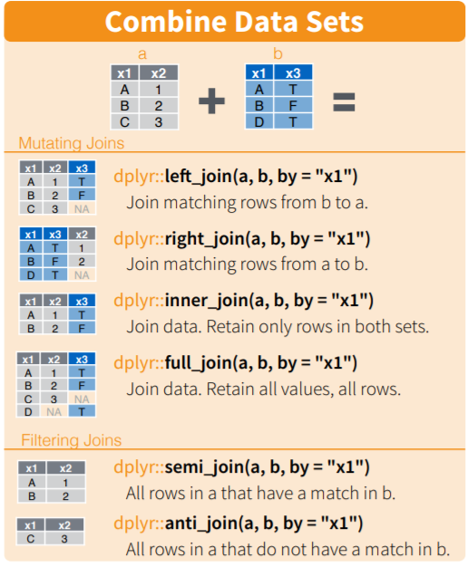
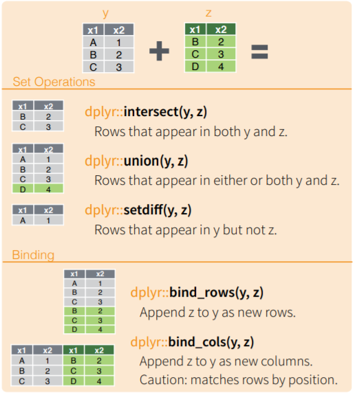

layout: true

<div class="my-footer"></div> 

```{r, include=FALSE,warning=FALSE,message=FALSE}
options(htmltools.dir.version = FALSE)
knitr::opts_chunk$set(
  message = FALSE,
  warning = FALSE,
  dev = "svg",
  fig.align = "center",
  #fig.width = 11,
  #fig.height = 5
  cache = TRUE
)

# define vars
om = par("mar")
lowtop = c(om[1],om[2],0.1,om[4])
library(tidyverse)
library(knitr)
#use_python("C:\\python\\python.exe")
options(dplyr.print_min = 5)
```

---

# Relational Databases

- Often want to combine data from multiple tables to summarize/model

```{r, echo = FALSE, fig.align='center', out.width = '600px'}
knitr::include_graphics("img/dbDiagram.jpg")
```

---

- The common types of joins we do are given below! (Using `dplyr` not the particular SQL language.)

```{r, echo = FALSE, fig.align='center', out.width="325px"}

```


---

- We often need some different logic to make our joins work. That exists in `dplyr` as well!

```{r, echo = FALSE, fig.align='center', out.width="400px"}

```


---

# Joins


- Let's go through our common joins!

- Inner Join: Returns records with matching keys in both tables

```{r, echo = FALSE, fig.align='center', out.width="350px"}
knitr::include_graphics("img/inner_join.png")
```


---

# Inner Join

Make our connection and look at the tables

```{r, message = FALSE, warning = FALSE}
library(DBI)
library(dplyr)
```

```{r, message = FALSE, warning = FALSE}
con <- dbConnect(RSQLite::SQLite(), "data/lahman.db")
dbListTables(con)
```

---

# Inner Join

Combine the `Batting` table and the `Pitching` table on common variables

```{r}
#note this code differs slightly from what was in the video!
inner_join(tbl(con, "Batting") |> filter(yearID == 2000), 
           tbl(con, "Pitching") |> filter(yearID == 2000),
           by = c("playerID", "stint", "teamID", "lgID")) |>
  collect()
```


---

# Can Write SQL code instead

- (I'm not a great SQL programmer)

```{r, eval = FALSE}
tbl(con, sql(
"SELECT p.playerID as pplayerID,
        p.stint as pstint,
        p.teamID as pteamID,
        p.lgID as plgID,
        p.G as pG,
        p.HR as pHR,
        p.BB as pBB,
        p.SO as pSO,
        p.HBP as pHBP,
        p.R as pR,
        p.SF as pSF,
        p.GIDP as pGIDP,
        p.IBB as pIBB,
        p.SH as pSH,
        p.W, p.L, p.GS, p.CG, p.SHO, p.SV, p.IPouts, p.ER, p.BAopp, 
        p.ERA, p.WP, p.BK, p.BFP, p.GF,
        b.*
FROM Pitching as p
INNER JOIN Batting as b on ((p.playerID = b.playerID) AND (pstint = b.stint) AND (pteamID = b.teamID) AND (plgID = b.lgID))
WHERE b.yearID = 2000 AND p.yearID = 2000"
)) 
```


---

# Joins

- Left Join: Returns all records from the 'left' table and any matching records from the 'right' table

```{r, echo = FALSE, fig.align='center', out.width="350px"}
knitr::include_graphics("img/left_join.png")
```


---

# Left Join: Return left table and matching right records

```{r}
left_join(tbl(con, "Batting") |> filter(yearID == 2000), 
           tbl(con, "Pitching") |> filter(yearID == 2000),
           by = c("playerID", "stint", "teamID", "lgID")) |>
  collect() |>
  select(playerID, ERA, everything())
```


---

# Joins

- Right Join: Returns all records from the 'right' table and any matching records from the 'left' table

```{r, echo = FALSE, fig.align='center', out.width="350px"}
knitr::include_graphics("img/right_join.png")
```

---

# Right Join

- Just do a left join and switch the table (or use `right_join()`)


```{r}
right_join(tbl(con, "Batting") |> filter(yearID == 2000),
           tbl(con, "Pitching") |> filter(yearID == 2000),
           by = c("playerID", "stint", "teamID", "lgID")) |>
  collect() |>
  select(playerID, ERA, everything())
```


---

# Joins

- Outer Join: Returns all records when there is a match from the 'left' or 'right' table (also called a **full join**)

```{r, echo = FALSE, fig.align='center', out.width="350px"}
knitr::include_graphics("img/outer_join.png")
```

---

# Outer Join: Return all matches from both tables

(All players are in the Batting table even if they have no at bats!)

```{r echo = TRUE}
full_join(tbl(con, "Batting") |> filter(yearID == 2000),
           tbl(con, "Pitching") |> filter(yearID == 2000),
           by = c("playerID", "stint", "teamID", "lgID")) |>
  collect()
```


---

# Other Joins

Those are the major joins covered by `dplyr`. Lots of other joins out there!

- [See here for examples](https://www.sqlitetutorial.net/sqlite-join/)! 

    + The right sidebar has more than the standard joins.

- Also ways to do [if then else type logic](https://www.sqlitetutorial.net/sqlite-case/), [intersections](https://www.sqlitetutorial.net/sqlite-intersect/), etc. in SQL

- Can do basic [summaries using SQL](https://www.sqlitetutorial.net/sqlite-avg/) as well (including [grouping](https://www.sqlitetutorial.net/sqlite-group-by/)), but we'll just use `dplyr` for that!


---

# Recap

- Joins are combining two tables

- inner_join - match records that appear in both tables
 
- left/right join

- full outer join

