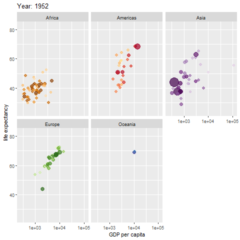

layout: true

<div class="my-footer"></div> 

```{r, include=FALSE,warning=FALSE,message=FALSE}
options(htmltools.dir.version = FALSE)
knitr::opts_chunk$set(
  message = FALSE,
  warning = FALSE,
  dev = "svg",
  fig.align = "center",
  #fig.width = 11,
  #fig.height = 5
  cache = TRUE
)

# define vars
om = par("mar")
lowtop = c(om[1],om[2],0.1,om[4])
library(tidyverse)
library(knitr)
#use_python("C:\\python\\python.exe")
options(dplyr.print_min = 5)
```

---

# Recap: `ggplot2`

A great plotting system!

To create plots:
    
- Create base object  
- Add `geom` or `stat` layers  
- Use `aes()` to map variables to attributes of the plot
- Add other layers to modify things


---

# `ggplot2` Smoothed Histogram    

Numeric variables - generally, describe distribution via a histogram or boxplot!  

- For a single numeric variable, describe the distribution via

    + Shape: Histogram, Density plot, ...
    + Comparing across a categorical variable: Boxplot
    
- For two numeric variables, describe the distribution via

    + Shape: Scatter plot
    

---

# Reading in Our Data

First, let's read in the appendicitis data from the previous lecture.

```{r}
library(tidyverse)
library(readxl)
app_data <- read_excel("data/app_data.xlsx", sheet = 1)
app_data <- app_data |>
  mutate(BMI = as.numeric(BMI),
         US_Number = as.character(US_Number),
         SexF = factor(Sex, levels = c("female", "male"), labels = c("Female", "Male")),
         DiagnosisF = as.factor(Diagnosis),
         SeverityF = as.factor(Severity))
app_data
```


---

# Density Plot

- **Kernel Smoother** - Smoothed version of a histogram  

- Common `aes` values (from [cheat sheet](https://rstudio.github.io/cheatsheets/data-visualization.pdf)):

&nbsp; &nbsp; &nbsp; &nbsp; `c + geom_density(kernel = "gaussian")`  

&nbsp; &nbsp; &nbsp; &nbsp; `x, y, alpha, color, fill, group, linetype, size, weight`

- Only `x =` is really needed


---

# `ggplot2` Smoothed Histogram      

- **Kernel Smoother** - Smoothed version of a histogram  

```{r,eval = TRUE, echo = TRUE, out.width = "650px", fig.align='center', out.height = '350px'}
g <- ggplot(app_data |> drop_na(RBC_Count), aes(x = RBC_Count))
g + geom_density()
```


---

# `ggplot2` Smoothed Histogram       

- **Kernel Smoother** - Smoothed version of a histogram  

- Remove really large value and use the `fill` aesthetic to compare groups! 

```{r,eval = TRUE, echo = TRUE, out.width = "650px", fig.align='center', out.height = '320px'}
g <- ggplot(app_data |> drop_na(RBC_Count, Diagnosis) |> filter(RBC_Count < 8), aes(x = RBC_Count))
g + geom_density(alpha = 0.5, aes(fill = Diagnosis))
```


---

# `ggplot2` Smoothed Histogram       

- **Kernel Smoother** - Smoothed version of a histogram  

- Recall `position` choices of `dodge`, `jitter`, `fill`, and `stack`

```{r,eval = TRUE, echo = TRUE, out.width = "650px", fig.align='center', out.height = '320px', warning = FALSE}
g <- ggplot(app_data |> drop_na(RBC_Count, Diagnosis) |> filter(RBC_Count < 8), aes(x = RBC_Count))
g + geom_density(alpha = 0.5, position = "fill", aes(fill = Diagnosis))
```


---

# `ggplot2` Boxplots

- **Boxplot** - Provides the five number summary in a graph

- Common `aes` values (from cheat sheet):

&nbsp; &nbsp; &nbsp; &nbsp; `f + geom_boxplot()`

&nbsp; &nbsp; &nbsp; &nbsp; `x, y, lower, middle, upper, ymax, ymin, alpha, color, fill, group, linetype, shape, size, weight`

- Only `x =, y =` are really needed  


---

# `ggplot2` Boxplots

```{r,eval = TRUE, echo = TRUE, out.width = "650px", fig.align='center', out.height = '350px', warning = FALSE}
g <- ggplot(app_data |> drop_na(RBC_Count, Diagnosis) |> filter(RBC_Count < 8))
g + geom_boxplot(aes(x = Diagnosis, y = RBC_Count, fill = Diagnosis))
```


---

# `ggplot2` Boxplots with Points

- Can add data points (jittered) to see shape of data better (or use violin plot)

```{r, error = TRUE, eval = TRUE, echo = TRUE, out.width = "650px", fig.align='center', out.height = '350px', warning = FALSE}
g <- ggplot(app_data |> drop_na(RBC_Count, Diagnosis) |> filter(RBC_Count < 8))
g + geom_boxplot(aes(x = Diagnosis, y = RBC_Count, fill = Diagnosis)) +
  geom_jitter(width = 0.1, alpha = 0.3)
```

- Oh, global vs local `aes()`!


---

# `ggplot2` Boxplots with Points

- Can add data points (jittered) to see shape of data better (or use violin plot)

```{r, error = TRUE, eval = TRUE, echo = TRUE, fig.align='center', out.height = '300px', warning = FALSE}
g <- ggplot(app_data |> drop_na(RBC_Count, Diagnosis) |> filter(RBC_Count < 8), 
            aes(x = Diagnosis, y = RBC_Count, fill = Diagnosis))
g + geom_boxplot() +
  geom_jitter(width = 0.2, alpha = 0.3)
```

---

# `ggplot2` Boxplots with Points

- Order of layers important!

```{r, error = TRUE, eval = TRUE, echo = TRUE, fig.align='center', out.height = '300px', warning = FALSE}
g <- ggplot(app_data |> drop_na(RBC_Count, Diagnosis) |> filter(RBC_Count < 8), 
            aes(x = Diagnosis, y = RBC_Count, fill = Diagnosis))
g + geom_jitter(width = 0.2, alpha = 0.3) + 
  geom_boxplot()
```


---

# `ggplot2` Violin Plots

- Violin plot similar to boxplot

```{r,eval = TRUE, echo = TRUE, fig.align='center', out.height = '300px', warning = FALSE}
g <- ggplot(app_data |> drop_na(RBC_Count, Diagnosis) |> filter(RBC_Count < 8), 
            aes(x = Diagnosis, y = RBC_Count, fill = Diagnosis))
g + geom_violin()
```


---

# `ggplot2` Scatter Plots

Two numerical variables

- **Scatter Plot** - graphs points corresponding to each observation

- Common `aes` values (from cheat sheet):

&nbsp; &nbsp; &nbsp; &nbsp; `e + geom_point()`

&nbsp; &nbsp; &nbsp; &nbsp; `x, y, alpha, color, fill, shape, size, stroke`

- Only `x =, y =` are really needed  


---

# `ggplot2` Scatter Plots

- **Scatter Plot** - graphs points corresponding to each observation

```{r,eval = TRUE, echo = TRUE, out.width = "650px", fig.align='center', out.height = '350px', warning = FALSE}
g <- ggplot(app_data |> drop_na(RBC_Count, Weight, Diagnosis) |> filter(RBC_Count < 8), 
            aes(x = Weight, y = RBC_Count, color = Diagnosis))
g + geom_point()
```

---

# `ggplot2` Scatter Plots with Trend Line

- Add trend lines easily  with `geom_smooth()`

```{r,eval = TRUE, echo = TRUE, out.width = "650px", fig.align='center', out.height = '350px', warning = FALSE}
g <- ggplot(app_data |> drop_na(RBC_Count, Weight, Diagnosis) |> filter(RBC_Count < 8), 
            aes(x = Weight, y = RBC_Count, color = Diagnosis))
g + geom_point() +  
    geom_smooth(method = lm) 
```


---

# `ggplot2` Scatter Plots with Text Points

- Text for points with `geom_text()`  

```{r,eval = TRUE, echo = TRUE, out.width = "650px", fig.align='center', out.height = '350px', warning = FALSE}
g <- ggplot(app_data |> drop_na(RBC_Count, Weight, Diagnosis) |> filter(RBC_Count < 8), 
            aes(x = Weight, y = RBC_Count, color = Diagnosis))
g + geom_text(aes(label = Nausea)) +  
    geom_smooth(method = lm) 
```


---

# `ggplot2` Scatter Plots with Text

- Can add a note to the plot with `geom_text()` too

```{r,eval = TRUE, echo = TRUE, out.width = "650px", fig.align='center', out.height = '350px', warning = FALSE}
correlation <- app_data |> 
  drop_na(RBC_Count, Weight, Diagnosis) |> 
  filter(RBC_Count < 8) |> 
  group_by(Diagnosis) |>
  select(RBC_Count, Weight, Diagnosis) |>
  summarize(cor_vals = cor(RBC_Count, Weight, use = "complete.obs"))
correlation
```


---

# `ggplot2` Scatter Plots with Text

- Can add a note to the plot with `geom_text()` too

```{r, eval = FALSE}
g <- ggplot(app_data |> drop_na(RBC_Count, Weight, Diagnosis) |> filter(RBC_Count < 8))
g + geom_point(aes(x = Weight, y = RBC_Count, color = Diagnosis)) +  
    geom_smooth(method = lm, aes(x = Weight, y = RBC_Count, color = Diagnosis)) +
    geom_text(x = 75, y = 6, size = 3, 
              label = paste0(correlation[1,1], " correlation: ", round(correlation[1,2], 2))) +
    geom_text(x = 75, y = 5.75, size = 3, 
              label = paste0(correlation[2,1], " correlation: ", round(correlation[2,2], 2)))
```


---

# `ggplot2` Scatter Plots with Text

- Can add a note to the plot with `geom_text()` too

```{r,eval = TRUE, echo = FALSE, fig.align='center', out.height = '350px', warning = FALSE}
g <- ggplot(app_data |> drop_na(RBC_Count, Weight, Diagnosis) |> filter(RBC_Count < 8))
g + geom_point(aes(x = Weight, y = RBC_Count, color = Diagnosis)) +  
    geom_smooth(method = lm, aes(x = Weight, y = RBC_Count, color = Diagnosis)) +
    geom_text(x = 75, y = 6, size = 3, 
              label = paste0(correlation[1,1], " correlation: ", round(correlation[1,2], 2))) +
    geom_text(x = 75, y = 5.75, size = 3, 
              label = paste0(correlation[2,1], " correlation: ", round(correlation[2,2], 2)))
```

---

# `ggplot2` Faceting  

Suppose we want to take one of our plots and produce similar plots across another variable!

How to create this plot across each `Management` category?  Use **faceting**!

```{r,eval = TRUE, echo = TRUE,  fig.align='center', out.height = '300px'}
ggplot(data = app_data |> drop_na(SexF, DiagnosisF), aes(x = SexF, fill = DiagnosisF)) + 
  geom_bar(position = "dodge") + 
  labs(x = "Sex")+ 
  scale_fill_discrete("Diagnosis") 
```


---

# `ggplot2` Faceting  

`facet_wrap(~ var)` - creates a plot for each setting of `var`  

- Can specify `nrow` and `ncol` or let R figure it out


---

# `ggplot2` Faceting  

`facet_wrap(~ var)` - creates a plot for each setting of `var`  

- Can specify `nrow` and `ncol` or let R figure it out

`facet_grid(var1 ~ var2)` - creats a plot for each combination of `var1` and `var2`  

- `var1` values across rows

- `var2` values across columns

- Use `. ~ var2` or `var1 ~ .` to have only one row or column  


---

# `ggplot2` Faceting  

- `facet_wrap(~ var)` - creates a plot for each setting of `var`  

```{r,eval = TRUE, echo = TRUE, out.width = "650px", fig.align='center', out.height = '350px', warning = FALSE}
ggplot(data = app_data |> drop_na(SexF, DiagnosisF, Management), aes(x = SexF, fill = DiagnosisF)) + 
  geom_bar(position = "dodge") + 
  labs(x = "Sex")+ 
  scale_fill_discrete("Diagnosis") +
  facet_wrap(~ Management)
```


---

# `ggplot2` FacetingCan be Used with Any `ggplot`

```{r,eval = TRUE, echo = TRUE, out.width = "650px", fig.align='center', out.height = '350px', warning = FALSE}
g <- ggplot(app_data |> drop_na(RBC_Count, Diagnosis, Sex) |> filter(RBC_Count < 8), 
            aes(x = Diagnosis, y = RBC_Count, fill = Diagnosis))
g + geom_boxplot() +
  geom_jitter(width = 0.2, alpha = 0.3) +
    facet_wrap(~ Sex)
```


---

# `ggplot2` FacetingCan be Used with Any `ggplot`

```{r,eval = TRUE, echo = TRUE, out.width = "650px", fig.align='center', out.height = '350px', warning = FALSE}
g <- ggplot(app_data |> drop_na(RBC_Count, Weight, Diagnosis, Sex) |> filter(RBC_Count < 8), 
            aes(x = Weight, y = RBC_Count, color = Diagnosis))
g + geom_point() +  
    geom_smooth(method = lm) +
    facet_wrap(~ Sex)
```


---

# `ggplot2` Themes  

```{r,eval = TRUE, echo = TRUE, out.width = "650px", fig.align='center', out.height = '350px', warning = FALSE}
g <- ggplot(app_data |> drop_na(RBC_Count, Weight, Diagnosis, Sex) |> filter(RBC_Count < 8), 
            aes(x = Weight, y = RBC_Count, color = Diagnosis))
g + geom_point() +  
    geom_smooth(method = lm) +
    facet_wrap(~ Sex) +
    theme_light()
```

---

# `ggplot2` Themes  

```{r,eval = TRUE, echo = TRUE, out.width = "650px", fig.align='center', out.height = '350px', warning = FALSE}
g <- ggplot(app_data |> drop_na(RBC_Count, Weight, Diagnosis, Sex) |> filter(RBC_Count < 8), 
            aes(x = Weight, y = RBC_Count, color = Diagnosis))
g + geom_point() +  
    geom_smooth(method = lm) +
    facet_wrap(~ Sex) +
    theme_dark()
```

---

# `ggplot2` Extensions  

Many extension packages that do nice things!  

- `GGally` package has the `ggpairs()` function

```{r,eval = TRUE, echo = TRUE, out.width = "650px", fig.align='center', out.height = '300px', warning = FALSE, message = FALSE}
library(GGally) #install if needed
ggpairs(app_data |> drop_na(RBC_Count, Weight, Diagnosis, Sex) |> filter(RBC_Count < 8),
        aes(colour = Diagnosis, alpha = 0.4), columns = c("RBC_Count", "Weight", "Sex"))
```

---

# `ggplot2` Extensions  

Over 100 registered extensions at <https://exts.ggplot2.tidyverse.org/>!

- `gganimate` package allows for the creation of gifs

```{r,eval = FALSE, echo = TRUE, out.width = "650px", fig.align='center', out.height = '350px', warning = FALSE, message = FALSE, results = FALSE}
#install each if needed
library(gapminder)
library(gganimate) 
library(gifski)

gif <- ggplot(gapminder, aes(gdpPercap, lifeExp, size = pop, colour = country)) +
          geom_point(alpha = 0.7, show.legend = FALSE) +
          scale_colour_manual(values = country_colors) +
          scale_size(range = c(2, 12)) +
          scale_x_log10() +
          facet_wrap(~continent) +
          # Here comes the gganimate specific bits
          labs(title = 'Year: {frame_time}', x = 'GDP per capita', y = 'life expectancy') +
          transition_time(year) +
          ease_aes('linear')
anim_save(filename = "img/myGif.gif", animation = gif, renderer = gifski_renderer())
```


---

# `ggplot2` Extensions  

Over 100 registered extensions at <https://exts.ggplot2.tidyverse.org/>!

- `gganimate` package allows for the creation of gifs

```{r, out.width = "350px", fig.align='center', echo = FALSE}

```

---

# Recap!

General `ggplot2` things:

- Can set local or global `aes()`

    + Generally, only need `aes()` if setting a mapping value that is dependent on the data

- Modify titles/labels by adding more layers

- Use either `stat` or `geom` layer

- Faceting (multiple plots) via `facet_grid()` or `facet_wrap()`

- `esquisse` is a [great package for exploring ggplot2](https://cran.r-project.org/web/packages/esquisse/vignettes/get-started.html)!


---

# Big Recap!

Goal: Understand types of data and their distributions  

- Numerical summaries (across subgroups)  

    + Contingency Tables  
    + Mean/Median  
    + Standard Deviation/Variance/IQR
    + Quantiles/Percentiles

- Graphical summaries (across subgroups)  

    + Bar plots  
    + Histograms  
    + Box plots  
    + Scatter plots