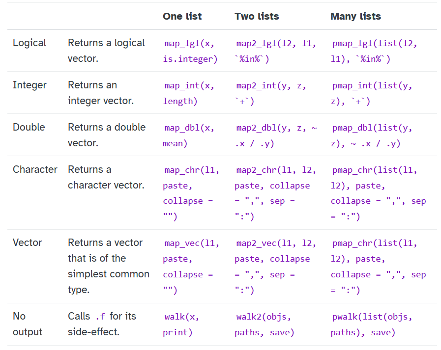

layout: true

<div class="my-footer"></div> 

```{r, include=FALSE,warning=FALSE,message=FALSE}
options(htmltools.dir.version = FALSE)
knitr::opts_chunk$set(
  message = FALSE,
  warning = FALSE,
  dev = "svg",
  fig.align = "center",
  #fig.width = 11,
  #fig.height = 5
  cache = TRUE
)

# define vars
om = par("mar")
lowtop = c(om[1],om[2],0.1,om[4])
library(tidyverse)
library(knitr)
#use_python("C:\\python\\python.exe")
options(dplyr.print_min = 5)
```

---

# `purrr` Package

- Provides a `tidyverse` alternative to the `apply()` family 

    + [Cheat sheet](https://rstudio.github.io/cheatsheets/html/purrr.html)

---

# `purrr` Package

- Provides a `tidyverse` alternative to the `apply()` family 

    + [Cheat sheet](https://rstudio.github.io/cheatsheets/html/purrr.html)

- Main advantage is more consistency and some helper functions

    + [Accepted answer here](https://stackoverflow.com/questions/45101045/why-use-purrrmap-instead-of-lapply) (by Hadley) gives some good details 

---

# `map()` 

- Always returns a `list`

- First arg is the list, second is the function

```{r}
set.seed(10)
my_list <- list(rnorm(100), runif(10), rgamma(40, shape = 1, rate = 1))
map(my_list, mean)
```


---

# `map()` 

- Allows for shorthand

- Suppose we want the second element of each list. Compare:

```{r}
map(my_list, 2)
```

```{r eval = FALSE}
lapply(my_list, function(x) x[[2]])
lapply(my_list, `[[`, 2)
```


---

# `purrr` 

- `purrr` functions also give a shorthand way to make anonymous functions

```{r}
map(my_list, \(x) mean(x))
map(my_list, \(x) max(x)-min(x))
```

---

# `map_*()`

- Allows you to specify the type of output

```{r}
map_dbl(my_list, mean)
```

- `map_chr()`, `map_lgl()`, ...  return vectors


---

# `map2()`

- Allows you to apply a function to two similar lists (returns a list)

```{r}
my_list_2 <- list(rnorm(100), runif(10), rgamma(40, shape = 1, rate = 1))
map2(my_list, my_list_2, \(x, y) mean(x)-mean(y))
```

---

# `pmap()`

- Extends this idea to an arbitrary number of lists

```{r}
my_list_3 <- list(rnorm(100), runif(10), rgamma(40, shape = 1, rate = 1))
pmap(list(my_list, my_list_2, my_list_3), 
     \(x, y, z) (mean(x)-mean(y))/mean(z))
```


---

# `walk()`

- `walk()` allows you to use a side-effect function but return the original data

```{r, out.width = '200px', fig.align='center'}
#just apply the function
par(mfrow = c(1, 3))
my_list |>
  map(hist)
```

---

# `walk()`

- `walk()` allows you to use a side-effect function but return the original data

```{r, out.width = '200px', fig.align='center'}
par(mfrow = c(1, 3))
#now apply the function but still have the original data
my_list |>
  walk(hist) |>
  map_dbl(mean)
```


---

# Summary of Common `purrr` Functions

- Plenty of other functionality provided (see [cheat sheet](https://rstudio.github.io/cheatsheets/html/purrr.html))

```{r, echo = FALSE, fig.align='center', out.width='500px'}

```


---

# List Columns

- Recall our connection between lists and data frames:

    + Data frame = list of equal length vectors
    
```{r}
typeof(iris)
str(iris)
```


---

# List Columns

- Recall our connection between lists and data frames:

    + Data frame = list of equal length vectors

- A list is a vector... if of appropriate length, it can be the column of a data frame!

```{r}
iris |>
  as_tibble() |>
  mutate(diffs = pmap(list(Sepal.Length, Sepal.Width, Petal.Length, Petal.Width), 
                      \(x, y, z, w) list(x-y, x-z, x-w))) |>
  select(diffs, everything())
```

---

# List Columns

- Recall our connection between lists and data frames:

    + Data frame = list of equal length vectors

- A list is a vector... if of appropriate length, it can be the column of a data frame!

```{r}
iris |>
  as_tibble() |>
  mutate(diffs = pmap(list(Sepal.Length, Sepal.Width, Petal.Length, Petal.Width), 
                      \(x, y, z, w) list(x-y, x-z, x-w))) |>
  pull(diffs)
```


---

# List Columns

- A more interesting example!

- Note: `purrr:pluck()` is a helper function for grabbing a named element or by index number

```{r}
library(httr)
library(jsonlite)
game_info <- GET("https://api-web.nhle.com/v1/score/2024-04-04") |>
  content("text") |> 
  fromJSON(flatten = TRUE, simplifyDataFrame = TRUE) |>
  pluck("games")
```

- `pluck()` could be replaced with 

```
`[[`("games")
```

---

# List-Columns

- Check the `tvBroadcasts` column!

```{r}
str(game_info, max.level = 1)
```


---

# Working with List-Columns

- In this case, our list-column contains a data frame in each list element:

```{r}
game_info$tvBroadcasts
```

---

# Working with List-Columns

- We can manipulate list-columns with `dplyr::mutate()`
- Since elements are lists, we want to use `map()` functions!

```{r}
game_info |>
  mutate(num_networks = map(tvBroadcasts, nrow)) |>
  select(num_networks, tvBroadcasts, everything())
```


---

# Recap!

`purrr` gives us a bit cleaner/more consistent way to apply functions to objects

- Lots of additional helper functions

- Use `apply()` family or `purrr` to improve your code!


