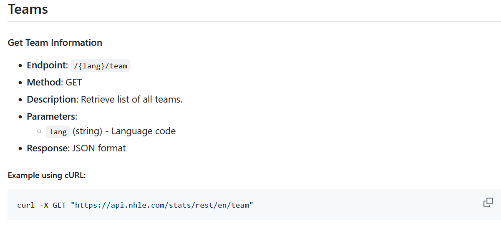
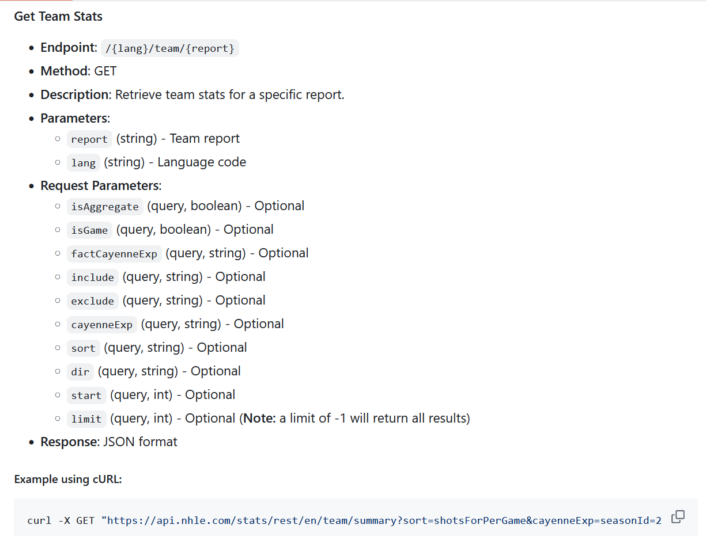

layout: true

<div class="my-footer"></div> 

```{r, include=FALSE,warning=FALSE,message=FALSE}
options(htmltools.dir.version = FALSE)
knitr::opts_chunk$set(
  message = FALSE,
  warning = FALSE,
  dev = "svg",
  fig.align = "center",
  #fig.width = 11,
  #fig.height = 5
  cache = TRUE
)

# define vars
om = par("mar")
lowtop = c(om[1],om[2],0.1,om[4])
library(tidyverse)
library(knitr)
#use_python("C:\\python\\python.exe")
options(dplyr.print_min = 5)
```

---

# Reading Data

Data comes in many formats such as

-   'Delimited' data: Character (such as [','](https://www4.stat.ncsu.edu/~online/datasets/scoresFull.csv) , ['\>'](https://www4.stat.ncsu.edu/~online/datasets/umps2012.txt), or \[' '\]) separated data
-   [Fixed field](https://www4.stat.ncsu.edu/~online/datasets/cigarettes.txt) data
-   [Excel](https://www4.stat.ncsu.edu/~online/datasets/Dry_Bean_Dataset.xlsx) data
-   From other statistical software, Ex: [SPSS formatted](https://www4.stat.ncsu.edu/~online/datasets/bodyFat.sav) data or [SAS data sets](https://www4.stat.ncsu.edu/~online/datasets/house.sas7bdat)
-   From a database
-   From an Application Programming Interface (API)

---

# APIs

Application Programming Interfaces (APIs) - a defined method for asking for information from a computer  

- Basically a protocol for computers to talk to one another  

- Useful for getting data  

- Useful for allowing others to access something you make (say a model)

---

# APIs  

- Most major sites with data now have an API. A key is usually required

    + Documentation can be spotty
    
    + Some have written functions for us :)
  
- Consider the[Census API](https://api.census.gov/data.html)

    + A `tidycensus` package exists!
    
```{r}
library(tidycensus) #install first!
```


---

# Census APIs 

- Consider the American Community Survey

    + Accessed via `get_acs()` function
    + [Variable list available](https://api.census.gov/data/2021/acs/acs5/profile/variables.html)


---

# Census APIs 

- Consider the American Community Survey

    + Accessed via `get_acs()` function
    + [Variable list available](https://api.census.gov/data/2021/acs/acs5/profile/variables.html)

```{r}
rent <- "DP04_0142PE" #PE means percentage
rent_data <- get_acs(variables = rent, 
        geography = "county",
        geometry = TRUE,# eturns the polygon data and allows for maps easily
        survey = "acs5",
        show_call = TRUE) #can add state and other things
```


---

# Plotting Census Data

- A great package can be combined for easy plots!

```{r, eval = FALSE}
#install mapview
rent_data |> 
  mapview::mapview(zcol = "estimate", 
                   layer.name = "Median rent as a % of gross income")
```


---

```{r, echo = FALSE}
#install mapview
rent_data |> 
  mapview::mapview(zcol = "estimate", 
                   layer.name = "Median rent as a % of gross income")
```

---

# Census API

- Ok, what is going on with the `get_acs()` function?

    + It calls `load_data_acs()` which builds the URL for us!

```
load_data_acs <- function(geography, formatted_variables, key, year, state = NULL,
                          county = NULL, zcta = NULL, survey, show_call = FALSE) {
  base <- paste("https://api.census.gov/data",
                  as.character(year), "acs",
                  survey, sep = "/")

  if (grepl("^DP", formatted_variables)) {
    message("Using the ACS Data Profile")
    base <- paste0(base, "/profile")
  }
...
```

---

# API Access in R  

- Awesome! When someone has done the work it is great :)

- Some resources on API packages:

    + [Someone's Github List](https://gist.github.com/zhiiiyang/fc19995f7e350f3c7fb940757f6213cf)
    + [Another one!](https://github.com/RomanTsegelskyi/r-api-wrappers)

- [List of APIs](https://apilist.fun/)


---

# API Example: Building it Ourselves

- Let's investigate the National Hockey League's (NHL) API

- Google shows a number of packages... but they get out of date or aren't maintained. Let's do it ourselves!

- Unfortunately, the NHL API is very poorly documented... 

    + [Thanks Zmalski](https://github.com/Zmalski/NHL-API-Reference), this helps!


---

# API Example: Building it Ourselves

Process:

- Build the appropriate URL 

- Use `httr:GET()` to contact the web site

- Data is usually JSON (or possibly XML). Parse it!

- Try to put into a data frame


---

# Aside: JSON Data

- Most APIs return data in JSON format

    + **JSON** - JavaScript Object Notation  
    + Can represent usual 2D data or heirarchical data


---

# Aside: JSON Data

- Uses key-value pairs  

```{r, eval = FALSE}
{  
  {  
    "name": "Barry Sanders"  
    "games" : 153  
    "position": "RB"  
  },  
  {  
    "name": "Joe Montana"  
    "games": 192  
    "position": "QB"  
  }  
} 
```


---

# JSON Packages in R

Four major R packages 

1. `rjson`  
2. `RJSONIO`  
3. `jsonlite`  

    + many nice features 
    + a little slower implementation  
    
4. `tidyjson`


---

# `jsonlite` Package

[`jsonlite`](https://www.rdocumentation.org/packages/jsonlite/) basic functions:

Function    | Description
----------- | --------------------------------------------------
`fromJSON`  | Reads JSON data from file path or character string. Converts and simplfies to R object  
`toJSON`    | Writes R object to JSON object  
`stream_in` | Accepts a *file connection* - can read streaming JSON data


---

# Build the URL

- First we want to build the URL to contact a particular end point of the API
- Suppose we first want team information. Documentation says

```{r, out.width = "500px", fig.align='center', echo = FALSE}

```


---

# Build the URL

We create a string for the URL:

```{r}
URL_ids <- "https://api.nhle.com/stats/rest/en/team"
```

- Now use `GET` from `httr` package

```{r}
id_info <- httr::GET(URL_ids)
str(id_info, max.level = 1)
```

---

# Build the URL

- Must parse this a bit... Usually data is in `content` or `results` element

    + Often use `rawToChar()` with `jsonlite::fromJSON()`
    
```{r}
library(jsonlite)
parsed <- fromJSON(rawToChar(id_info$content))
team_info <- as_tibble(parsed$data)
team_info
```


---

# Build the URL

- Now we can get some team stats through the same process! 

```{r, out.width = "500px", fig.align='center', echo = FALSE}

```


---

# Build the URL

- A few things can be modified but it isn't clear here what the values could be. 
```{r}
URL_team_stats <- 
"https://api.nhle.com/stats/rest/en/team/summary?sort=wins&cayenneExp=seasonId=20232024%20and%20gameTypeId=2"
```

- `GET()` it and parse it with the same process

```{r}
team_stats_return <- httr::GET(URL_team_stats)
parsed_team_stats <- fromJSON(rawToChar(team_stats_return$content))
team_stats <- as_tibble(parsed_team_stats$data)
```

---

# Check it Out

```{r}
team_stats |> 
  select(teamId, teamFullName, everything())
```

---

# Implementing a Model in Production  

Later:  Need a way to make your model available to others  

- Can write an API that accesses your model  

- Hosted on a server or locally  

- Not traditionally done in R but can be!


---

# Recap  

- APIs are a common tool used for communicating about data

    + Can be used for other things as well
    
- Accessing data through an API involves building appropriate communication message (URL usually)

- Some API packages already exist

- Others, we need to parse the data ourselves!


