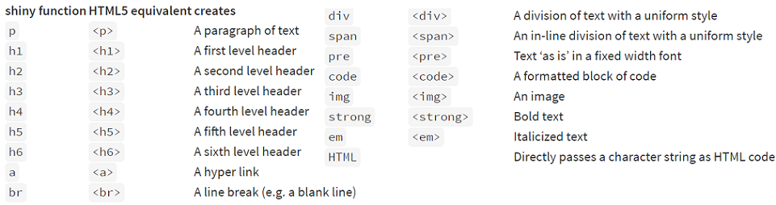
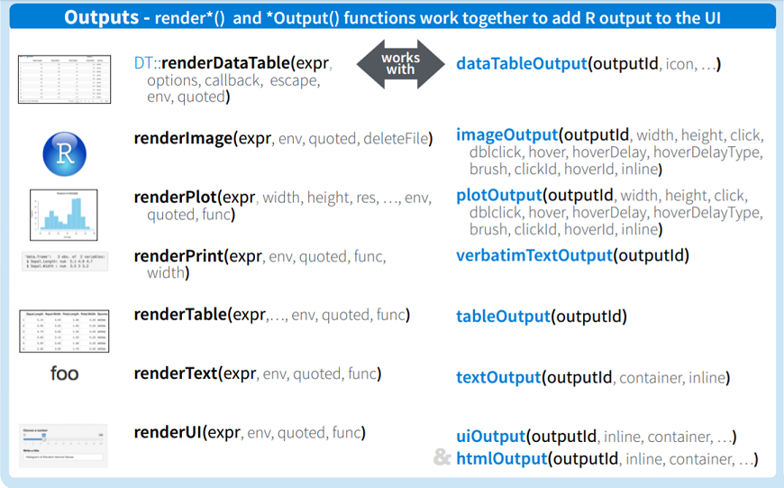

layout: true

<div class="my-footer"></div> 

```{r, include=FALSE,warning=FALSE,message=FALSE}
options(htmltools.dir.version = FALSE)
knitr::opts_chunk$set(
  message = FALSE,
  warning = FALSE,
  dev = "svg",
  fig.align = "center",
  #fig.width = 11,
  #fig.height = 5
  cache = FALSE
)

# define vars
om = par("mar")
lowtop = c(om[1],om[2],0.1,om[4])
library(tidyverse)
library(shiny)
library(knitr)
#use_python("C:\\python\\python.exe")
options(dplyr.print_min = 5)
```

---

# Recap

- `app.R` file contains `ui`, `server`, and code to run the app
- UI can be built in many ways!

    + `bslib` functions give nice layouts and functionality (`page_sidebar()`, `cards()`, `value_box()`, etc.)

- Widgets (`*Input` functions), Text, HTML elements, etc. are added to the UI


---

# UI: More About Widgets

- Widgets all follow the same structure

    - `widgetName("inputId", label = "Title the user sees", ...)`

    - The `inputId` is how you access the inputs when creating plots, summaries, etc. in the server


---

# UI: Adding Elements  

- Within **layout** functions add elements to UI separated by `,`

    - Can add plain strings and formatted text (using HTML type functions)  

```{r, out.width = "100%", fig.align='center', echo = FALSE}

```


---

# Widget & Text Example  

- Check code for [kNN app](https://github.com/jbpost2/kNN/blob/master/app.R) ([github](https://github.com/jbpost2/kNN) site)

    + Note the separation of elements by `,` within a layout-style function!

```{r, eval = FALSE}
ui <- fluidPage(
  pageWithSidebar(
    headerPanel('k-Nearest Neighbours Classification'),
    sidebarPanel(
      sliderInput('k', 'Select the Number of Nearest Neighbours', value = 25, min = 1, max = 150),
      checkboxInput('showN', label = "Show the neighbourhood for one point (click to select a point)"),
      a("App credit: https://github.com/schoonees/kNN", href = "https://github.com/schoonees/kNN")
    ),
    mainPanel(
      plotOutput('plot1', width = "600px", height = "600px",  click = "click_plot")
    )
  )
)
```


---

layout: false

# Server: Creating Outputs

- Outputs can be created in the UI using `*Output` functions

- These correspond to a particular `render*` function in the server

```{r, fig.align='center', out.width="60%", echo = FALSE}

```


---

# `render*` Functions

- These define **reactive contexts** that allow you to use info from widgets (via `input$inputId`)

```{r, eval = FALSE}
output$plot1 <- renderPlot({...
    ## Fit model
    fit <- knn(train = train, 
               test = test, 
               cl = trainclass, 
               k = input$k, 
               prob = TRUE)
    ...
    ## Plot create empty plot
    plot(train, asp = 1, type = "n", xlab = "x1", ylab = "x2",
         xlim = range(pts2), ylim = range(pts2),
         main =  paste0(input$k, "-Nearest Neighbours"))
    ...
```


---

# `render*` Functions

- These define **reactive contexts** that allow you to use info from widgets (via `input$inputId`)

- Each `render*` function tries to coerce the last code run to the appropriate type of output

```{r, fig.align='center', out.width="60%", echo = FALSE}

```


---

# `render*` Functions

- These define **reactive contexts** that allow you to use info from widgets (via `input$inputId`)

- Each `render*` function tries to coerce the last code run to the appropriate type of output

- Corresponding `*Output` function goes in the UI

```{r, eval = FALSE}
    mainPanel(
      plotOutput('plot1'),
      textOutput('my_text') #goes with output$my_text <- renderText({...}) in server
    )
```


---

# Back to the Tutorial!

- Read through the following pages of the Posit tutorial (**complete the `Your Turn` sections within these lessons** - no need to turn anything in, this is just to help you learn!)

    - [Display reactive outputs](https://shiny.posit.co/r/getstarted/shiny-basics/lesson4/)
    - [Use R scripts and data](https://shiny.posit.co/r/getstarted/shiny-basics/lesson5/)
    - [Use reactive expressions](https://shiny.posit.co/r/getstarted/shiny-basics/lesson6/)
    - [Share your apps](https://shiny.posit.co/r/getstarted/shiny-basics/lesson7/)