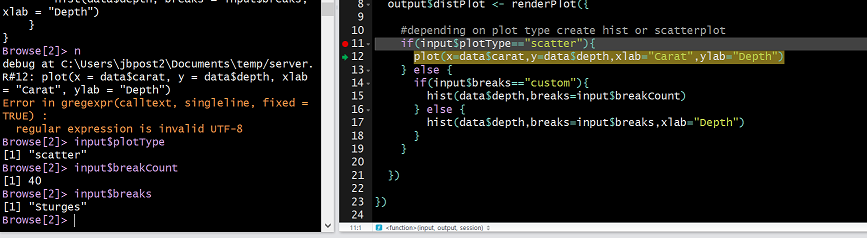
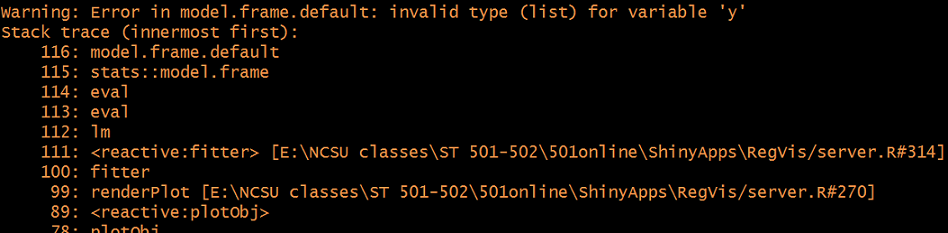

```{r setup, echo = FALSE, message = FALSE, warning = FALSE}
library(dplyr)
options(dplyr.print_min = 5)
library(knitr)
library(readr)
library(plotly)
library(DT)
#opts_chunk$set(echo = FALSE)
```

layout: false

# Other Shiny Stuff!

- Validating inputs and such
- Plotly
- Debugging!

---

# Validating Inputs

- Often errors will show if computations are running or inputs are temporarily changed ([Bad Shiny Example](https://shiny.stat.ncsu.edu/jbpost2/SamplingDistribution/))

    + Can validate inputs/data!
    
```{r,eval = FALSE}
validate(
  need(!is.null(sample_corr$corr_data), "Please select your variables, subset, 
       and click the 'Get a Sample!' button.")
)
```

- [Check this out here](https://shiny.stat.ncsu.edu/jbpost2/FocusLessonSLR/)


---

# Validating Data

- We also need to verify values supplied are of the right type

    + Easy to do with the `shinyalert` package!

```{r, eval = FALSE}
observeEvent(input$submit_proportion, {
  if(!is.numeric(input$proportion)){
    shinyalert(title = "Oh no!", "You must supply a number between 0 and 1!", type = "error")
  }
```

- [Check this out here](https://shiny.stat.ncsu.edu/jbpost2/FocusLessonCI/)


---

# Loaders

- Sometimes a plot or computation will take a while to show

    + User may think an error has occurred and click away or reclick causing more delay...
    
    + Can add spinners and things via `shinycssloaders`

```{r, eval = FALSE}
tabPanel(title = "Map View", 
         shinycssloaders::withSpinner(
           leaflet::leafletOutput("map_plot"))
         )
```

- [Check this out here](https://shiny.stat.ncsu.edu/jbpost2/FocusLessonZ/)


---

# Plotly!

- Know how to plot with `ggplot2`

- Plots are not inherently interactive...

    + Install `plotly` package 
    + Wrap any ggplot in `ggp
    + Change `renderPlot()` and `plotOutput()` functions to `renderPlotly()` and `plotlyOutput()`

```{r, eval = FALSE}
...
 plotlyOutput("boot_graph")
...
output$boot_graph <- renderPlotly({
  g <- ggplot(my_plot_data, aes(x = phat)) +
  geom_histogram(bins = 50, fill = "black", aes(group = Quantile))
  ggplotly(g, tooltip = c("x", "group"))
```

- [Check this out here](https://shiny.stat.ncsu.edu/jbpost2/FocusLessonCI/)

---

# Debugging  

- Much harder in shiny!  
  
- [Shiny debugging page](https://shiny.posit.co/r/articles/improve/debugging/)  

- Recommendations: 

    + Get static working code, then transfer to shiny  
    + Build app in small pieces, testing as you go


---

# Basic Debugging 

- Can use `observe({print(...)})`  

```{r,echo=TRUE,eval=FALSE}
observe({print(input$NI + 10)})
```  


---

# Debugging  

Three major approaches:  

  1. Breakpoints - Pausing execution of your program

  2. Tracing - Collecting information as your program runs

  3. Error handling - Finding the source of errors (both on the client and server side) and ascertaining their cause.  

---

# Breakpoints  

- Easiest method to debug!

    + Can be used in `server.r`  
    + Click to the left of the line number  

```{r, echo = FALSE, out.width='800px', fig.align='center'}

```

- Now can access values and step through program  


---

# Dynamic Breakpoints

- You can add an actionButton() that when clicked calls `browser()`

    + This kicks you into a debugger with all current inputs!

- Can make Shiny enter the debugger when an error occurs by using the following statement:  

```{r,echo=TRUE,eval=FALSE}
options(shiny.error = browser)
```  


---

# Error Handling  

- Check stack trace shiny returns

```{r, echo = FALSE, out.width='800px', fig.align='center'}

```


---

# Recap

- Validating inputs and such
- Plotly
- Debugging!
