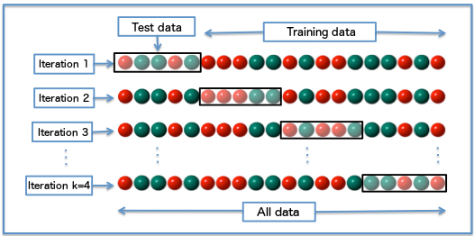

```{r, include=FALSE,warning=FALSE,message=FALSE}
options(htmltools.dir.version = FALSE)
knitr::opts_chunk$set(
  message = FALSE,
  warning = FALSE,
  dev = "svg",
  fig.align = "center",
  #fig.width = 11,
  #fig.height = 5
  cache = FALSE
)

# define vars
om = par("mar")
lowtop = c(om[1],om[2],0.1,om[4])
library(tidyverse)
library(knitr)
```

layout: false
class: title-slide-section-red, middle

# Cross-Validation
Justin Post 

---
layout: true

<div class="my-footer"></div> 

---

# Recap

- Judge the model's effectiveness at predicting using a metric comparing the predictions to the observed value

- Often split data into a training and test set
    + Perhaps 70/30 or 80/20
    
- Next: Cross-validation as an alternative to just train/test (and why we might do both!)


---

# Issues with Trainging vs Test Sets

Why may we not want to just do a basic training/test split?

- If we don't have much data, we aren't using it all when fitting the models

- Data is randomly split into training/test

    + May just get a weird split by chance
    + Makes metric evaluation a somewhat variable measurement depending on number of data points

---

# Issues with Trainging vs Test Sets

Why may we not want to just do a basic training/test split?

- If we don't have much data, we aren't using it all when fitting the models

- Data is randomly split into training/test

    + May just get a weird split by chance
    + Makes metric evaluation a somewhat variable measurement depending on number of data points

- Instead, we could consider splitting the data multiple ways, do the fitting/testing process, and combine the results!
    + Idea of cross validation!
    + A less variable measurement of your metric that uses all the data
    + Higher computational cost!


---

# Cross-validation

Common method for assessing a predictive model

```{r, echo = FALSE, out.width="600px"}

```


---

# Cross-Validation Idea

$k$ fold Cross-Validation (CV)

- Split data into k folds
- Train model on first k-1 folds, test on kth to find metric value
- Train model on first k-2 folds and kth fold, test on (k-1)st fold to find metric value
- ...


---

# Cross-Validation Idea

$k$ fold Cross-Validation (CV)

- Split data into k folds
- Train model on first k-1 folds, test on kth to find metric value
- Train model on first k-2 folds and kth fold, test on (k-1)st fold to find metric value
- ...


Find CV error 
- Combine test metrics across test folds
- For example, average all MSE metrics
- **Key = no predictions used in the value of the metric were found on data that were used to train that model!**

