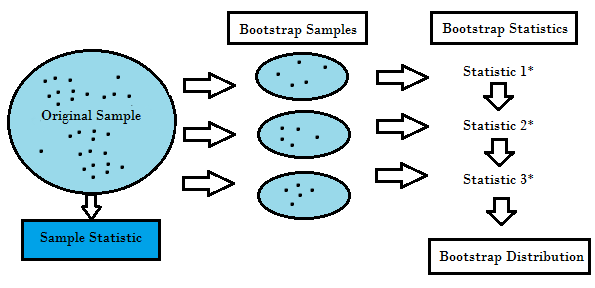

  
  
```{r, include=FALSE,warning=FALSE,message=FALSE}
options(htmltools.dir.version = FALSE)
knitr::opts_chunk$set(
  message = FALSE,
  warning = FALSE,
  dev = "svg",
  fig.align = "center",
  #fig.width = 11,
  #fig.height = 5
  cache = TRUE
)

# define vars
om = par("mar")
lowtop = c(om[1],om[2],0.1,om[4])
library(tidyverse)
library(knitr)
options(dplyr.print_min = 5)
set.seed(10)
```


# Recap 

Looked at a few common supervised learning models for regression and classification tasks

- MLR, Penalized MLR, & Regression Trees

- Logistic Regression & Classification Trees

Now we'll investigate commonly used *ensemble* methods


---

# Prediction with Tree Based Methods

If we care mostly about prediction not interpretation  

- Often use **bootstrapping** to get multiple samples to fit on  
- Can average across many fitted trees  
- Decreases variance over an individual tree fit  

  
 
---

# Prediction with Tree Based Methods

If we care mostly about prediction not interpretation  

- Often use **bootstrapping** to get multiple samples to fit on  
- Can average across many fitted trees  
- Decreases variance over an individual tree fit  
  
Major ensemble tree methods  

1. Bagging (boostrap aggregation)  
2. Random Forests (extends idea of bagging - includes bagging as a special case)  
3. Boosting (*slow* training of trees)  


---

# Bagging  

Bagging = Bootstrap Aggregation - a general method  

Bootstrapping  

- resample from the data (non-parametric) or a fitted model (parameteric)  

- for non-parameteric  

    + treats sample as population  
    + resampling done with replacement  
    + can get same observation multiple times  
    
    
---

# Bagging  

Bagging = Bootstrap Aggregation - a general method  

Bootstrapping  

- resample from the data (non-parametric) or a fitted model (parameteric)  

- for non-parameteric  

    + treats sample as population  
    + resampling done with replacement  
    + can get same observation multiple times  
    
- method or estimation applied to each resample  

- traditionally used to obtain standard errors (measures of variability) or construct confidence intervals  


---

# Non-Parametric Bootstrapping  

```{r, out.width="800px", echo = FALSE, fig.caption = "statisticshowto.datasciencecentral.com"}

```


---

# Bagging  

- Create many bootstrap (re)samples, $j = 1,..., B$


---

# Bagging  

- Create many bootstrap (re)samples, $j = 1,..., B$

- Fit tress to each (re)sample

    + Have $B$ fitted trees
    

---

# Bagging  

- Create many bootstrap (re)samples, $j = 1,..., B$

- Fit tress to each (re)sample

    + Have $B$ fitted trees

- For a given set of predictor values, find $\hat{y}$ for each tree

    + Call prediction for a given set of $x$ values $\hat{y}^{*j}(x)$

---

# Bagging  

- Create many bootstrap (re)samples, $j = 1,..., B$

- Fit tress to each (re)sample

    + Have $B$ fitted trees

- For a given set of predictor values, find $\hat{y}$ for each tree

    + Call prediction for a given set of $x$ values $\hat{y}^{*j}(x)$

- Combine the predictions from the trees to create the final prediction!

    + For regression trees, usually use the average of the predictions
    
    $$\hat{y}(x) = \frac{1}{B}\sum_{j=1}^{B} \hat{y}^{*j}(x)$$
    

---

# Bagging  

- Create many bootstrap (re)samples, $j = 1,..., B$

- Fit tress to each (re)sample

    + Have $B$ fitted trees

- For a given set of predictor values, find $\hat{y}$ for each tree

    + Call prediction for a given set of $x$ values $\hat{y}^{*j}(x)$

- Combine the predictions from the trees to create the final prediction!

    + For classification trees, usually use the **majority vote** 
    
    $$\mbox{Use most common prediction made by all bootstrap trees}$$


---

layout: false

# Using `tidymodels` to Fit a Bagged Tree Model

- Read in our heart disease data

```{r message = FALSE, warning = FALSE}
library(tidyverse)
library(tidymodels)
heart_data <- read_csv("https://www4.stat.ncsu.edu/online/datasets/heart.csv") |>
  filter(RestingBP > 0) #remove one value
heart_data <- heart_data |> mutate(HeartDisease = factor(HeartDisease))
heart_split <- initial_split(heart_data, prop = 0.8)
heart_train <- training(heart_split)
heart_test <- testing(heart_split)
heart_CV_folds <- vfold_cv(heart_train, 10)
heart_data
```


---

# Using `tidymodels` to Fit a Bagged Tree Model 

- Recall: For tree based methods we don't need to worry about interactions
- Can reuse the recipes from previous!

```{r message = FALSE, warning = FALSE}
LR3_rec <- recipe(HeartDisease ~ Age + Sex + ChestPainType + RestingBP + RestingECG + MaxHR + ExerciseAngina, 
                  data = heart_train) |>
  step_normalize(all_numeric(), -HeartDisease) |>
  step_dummy(Sex, ChestPainType, RestingECG, ExerciseAngina)
LR3_rec |> 
  prep(heart_train) |> 
  bake(heart_train) |> 
  colnames()
```


---

# Using `tidymodels` to Fit a Bagged Tree Model

+ Now set up our model type and engine

+ Using [this parsnip](https://parsnip.tidymodels.org//reference/details_bag_tree_rpart.html) model

    + Could tune on a few things here if we'd like
    
```{r}
bag_spec <- bag_tree(tree_depth = 5, min_n = 10, cost_complexity = tune()) |>
  set_engine("rpart") |>
  set_mode("classification")
```


---

# Using `tidymodels` to Fit a Bagged Tree Model

+ Create our workflows

```{r}
#install baguette package if not already done!
library(baguette)
bag_wkf <- workflow() |>
  add_recipe(LR3_rec) |>
  add_model(bag_spec)
```


---

# Using `tidymodels` to Fit a Bagged Tree Model

+ Fit to our CV folds! 

    + Note: CV isn't really necessary. We could use out-of-bag observations to determine how well our model works instead!
    
```{r}
bag_fit <- bag_wkf |>
  tune_grid(resamples = heart_CV_folds, 
            grid = grid_regular(cost_complexity(),
                                levels = 15),
            metrics = metric_set(accuracy, mn_log_loss))
bag_fit
```
    
---

# Using `tidymodels` to Fit a Bagged Tree Model

+ Check our metrics across the folds!

+ Look at log loss and sort it

```{r}
bag_fit |>
  collect_metrics() |>
  filter(.metric == "mn_log_loss") |> 
  arrange(mean)
```


---

# Using `tidymodels` to Fit a Bagged Tree Model

- Get our best tuning parameter

```{r}
bag_best_params <- select_best(bag_fit, "mn_log_loss")
bag_best_params
```

- Refit on the entire training set using this tuning parameter

```{r, message = FALSE, warning = FALSE}
bag_final_wkf <- bag_wkf |>
  finalize_workflow(bag_best_params)
bag_final_fit <- bag_final_wkf |>
  last_fit(heart_split, metrics = metric_set(accuracy, mn_log_loss))
```


---

# Using `tidymodels` to Fit a Logistic Regression Model

- For comparison, let's fit our same logistic regression model from previous

```{r}
LR_spec <- logistic_reg() |>
  set_engine("glm")
LR3_wkf <- workflow() |>
  add_recipe(LR3_rec) |>
  add_model(LR_spec)
LR3_fit <- LR3_wkf |>
  fit_resamples(heart_CV_folds, metrics = metric_set(accuracy, mn_log_loss))
rbind(LR3_fit |> collect_metrics(),
      bag_fit |> collect_metrics() |>
        filter(cost_complexity == bag_best_params$cost_complexity) |> 
        select(-cost_complexity))
```


---

# Using `tidymodels` to Compare Our Models

- Take these models to the test set and see how they do

```{r}
LR_final_fit <- LR3_wkf |>
  fit(heart_train) |>
  last_fit(heart_split, metrics = metric_set(accuracy, mn_log_loss))

LR_final_fit |> collect_metrics()
bag_final_fit |> collect_metrics()
```

---

# Investigate the Bagged Tree Model

- As before, we can extract our final model and check it out

- Let's first refit to the entire data set

```{r}
bag_full_fit <- bag_final_wkf |>
  fit(heart_data)
bag_full_fit
```


---

# Investigate the Bagged Tree Model

- As before, we can extract our final model and check it out

- Extract the final model and then plot the variable importance

```{r, eval = FALSE}
bag_final_model <- extract_fit_engine(bag_full_fit) 
bag_final_model$imp |>
  mutate(term = factor(term, levels = term)) |>
  ggplot(aes(x = term, y = value)) + 
  geom_bar(stat ="identity") +
  coord_flip()
```


---

# Investigate the Bagged Tree Model

- As before, we can extract our final model and check it out

- Extract the final model and then plot the variable importance

```{r, echo = FALSE, fig.align='center', out.width = '400px'}
bag_final_model <- extract_fit_engine(bag_full_fit) 
bag_final_model$imp |>
  mutate(term = factor(term, levels = term)) |>
  ggplot(aes(x = term, y = value)) + 
  geom_bar(stat ="identity") +
  coord_flip()
```

---

# Random Forests  

- Uses same idea as bagging  
- Create multiple trees from bootstrap samples
- Average results in some way for final prediction


Difference:  

- Doesn't use all predictors at each step!
- Considers splits using a random subset of predictors each time (# is a tuning parameter)


---

# Random Forests  

- Uses same idea as bagging  
- Create multiple trees from bootstrap samples
- Average results in some way for final prediction


Difference:  

- Doesn't use all predictors at each step!
- Considers splits using a random subset of predictors each time (# is a tuning parameter)

But why?  

- If a really strong predictor exists, every bootstrap tree will probably use it for the first split (2nd split, etc.)
- Makes bagged trees predictions more correlated
- Correlation --> smaller reduction in variance from aggregation


---

# Using `tidymodels` to Fit a Random Forest Model

By randomly selecting a subset of predictors, a good predictor or two won't dominate the tree fits  

- Rules of thumb exist for the number to use but better to use CV!

- Let's use the same recipe but fit a random forest model

```{r}
rf_spec <- rand_forest(mtry = tune()) |>
  set_engine("ranger") |>
  set_mode("classification")
```


---

# Using `tidymodels` to Fit a Random Forest Model

+ Create our workflows

```{r}
rf_wkf <- workflow() |>
  add_recipe(LR3_rec) |>
  add_model(rf_spec)
```


---

# Using `tidymodels` to Fit a Random Forest Model

+ Fit to our CV folds! 

    + Note: CV isn't really necessary. We could use out-of-bag observations to determine how well our model works instead!
    
```{r}
rf_fit <- rf_wkf |>
  tune_grid(resamples = heart_CV_folds, 
            grid = 7,
            metrics = metric_set(accuracy, mn_log_loss))
```
    
---

# Using `tidymodels` to Fit a Random Forest Model

+ Check our metrics across the folds!

+ Look at log loss and sort it

```{r}
rf_fit |>
  collect_metrics() |>
  filter(.metric == "mn_log_loss") |> 
  arrange(mean)
```


---

# Using `tidymodels` to Fit a Random Forest Model

- Get our best tuning parameter

```{r}
rf_best_params <- select_best(rf_fit, "mn_log_loss")
rf_best_params
```

- Refit on the entire training set using this tuning parameter

```{r, message = FALSE, warning = FALSE}
rf_final_wkf <- rf_wkf |>
  finalize_workflow(rf_best_params)
rf_final_fit <- rf_final_wkf |>
  last_fit(heart_split, metrics = metric_set(accuracy, mn_log_loss))
```


---

# Compare our Models on the Test Set

- Random Forest model does better than bagging! Could tune more parameters to possibly improve

```{r}
LR_final_fit |> collect_metrics()
bag_final_fit |> collect_metrics()
rf_final_fit |> collect_metrics()
```


---

# Recap

Averaging many trees can greatly improve prediction

- Comes at a loss of interpretability
- Variable importance measures can be used

Bagging 
- Fit many trees on bootstrap samples and combine predictions in some way

Random Forest
- Do bagging but randomly select the predictors to use at each split


