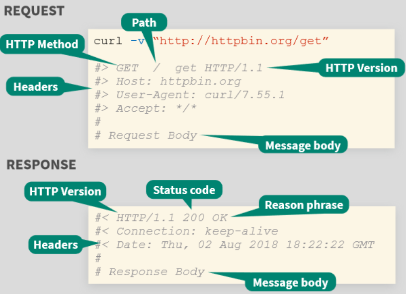

  
  
```{r, include=FALSE,warning=FALSE,message=FALSE}
options(htmltools.dir.version = FALSE)
knitr::opts_chunk$set(
  message = FALSE,
  warning = FALSE,
  dev = "svg",
  fig.align = "center",
  #fig.width = 11,
  #fig.height = 5
  cache = TRUE
)

# define vars
om = par("mar")
lowtop = c(om[1],om[2],0.1,om[4])
library(tidyverse)
library(knitr)
options(dplyr.print_min = 5)
set.seed(10)
```


# APIs and Docker  

APIs - a defined method for asking for information from a computer  

- Useful for getting data  

- Useful for allowing others to run your code and produce something

---

# APIs and Docker  

APIs - a defined method for asking for information from a computer  

- Useful for getting data  

- Useful for allowing others to run your code and produce something

Docker - a 'container' to easily transport your code to others  

- Include all relevant files (R, packages, etc.)  

Ideas important for putting work into pipeline!  

---

# Implementing a Model in Production  

Need a way to make your model available to others  

- Can write an API that accesses your model  
- Not traditionally done in R!  
- Often done in python or lower level language
- Can be done using the `plumber` package


---

# API Basics

`plumber` allows us to build a *REST API*

- Takes in an HTTP request from a client and outputs a response

    + Request and responses are specifically formatted
    
```{r, echo = FALSE, fig.align='center', out.width = '400px'}

```


---

# `plumber` Package  

Package creates API by you **decorating** your code with appropriate comments  

- `#*`  

Ex: Standard R function to paste a message together with comments prior

```{r, eval = FALSE}
#Send a message
#* @get /readme
function(){
  "This is our basic API"
}

#http://localhost:8000/readme
```

Let's try the template `plumber` file from RStudio!


---

# `plumber` Package  

- Endpoints are the logic defining what is returned from a request
- `@get`: a get request, specified by providing something like `/echo`
- Inputs are taken as strings by default

```{r, eval = FALSE}
#* Find natural log of a number
#* @param num Number to find ln of
#* @get /ln
function(num){
  log(as.numeric(num))
}

#http://localhost:PORT/ln?num=1
```


---

# `plumber` Package  

Another example of syntax  

```{r, eval = FALSE}
#* Find multiple of two numbers
#* @param num1 1st number
#* @param num2 2nd number
#* @get /mult
function(num1, num2){
  as.numeric(num1)*as.numeric(num2)
}

#http://localhost:PORT/mult?num1=10&num2=20
```

---

# `plumber` Package  

Output is generally in JSON format  

Can alter that:  

- for HTML (@serializer html)  
- for PNG (@serializer png), for JPEG (@serializer jpeg)
- for htmlwidget (@serializer htmlwidget)  

---

# `plumber` Package  

Plot output as png  

```{r, eval = FALSE}
#* Plot of iris data
#* @serializer png
#* @param type base or ggally
#* @param color TRUE or FALSE (only for ggally)
#* @get /plotiris
function(type = "base", color = FALSE){
  if(tolower(type) == "ggally"){
    if(color){
      a <- GGally::ggpairs(iris, aes(color = Species))
      print(a)
    } else {
      a <- GGally::ggpairs(iris)
      print(a)
    }
  } else {
    pairs(iris)
  }
}
#http://localhost:PORT/plotiris?type=base
```

---

# `plumber` Package  

- HTML widget as output

```{r, eval = FALSE}
#* Plotting widget
#* @serializer htmlwidget
#* @param lat latitude
#* @param lng longitude
#* @get /map
function(lng = 174.768, lat = -36.852){
m <- leaflet::leaflet() |>
  addTiles() |>  # Add default OpenStreetMap map tiles
  addMarkers(as.numeric(lng), as.numeric(lat))
m  # Print the map
}

#http://localhost:PORT/map?lng=174&lat=-36
```


---

# Basic API Process  

- Create your R functions  

- Load the `plumber` library  

- Put them into a file to source with the `plumb` function (or use RStudio's button)

- Code way: 

```{r, eval = FALSE}
library(plumber)
r <- plumb("API/myAPI.r")
r$run(port = 8000)
#is hosted at http://localhost:8000
```


---

# Recap

- Create our API via `plumber` package

- Decorate code with specific comments

- [Many other things](https://www.rplumber.io/) can be done we didn't cover!