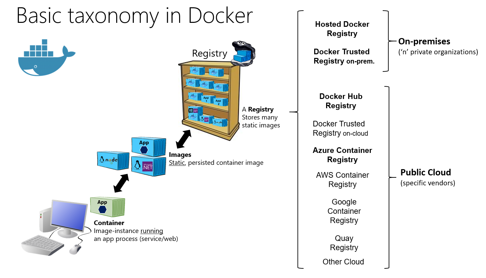

  
  
```{r, include=FALSE,warning=FALSE,message=FALSE}
options(htmltools.dir.version = FALSE)
knitr::opts_chunk$set(
  message = FALSE,
  warning = FALSE,
  dev = "svg",
  fig.align = "center",
  #fig.width = 11,
  #fig.height = 5
  cache = TRUE
)

# define vars
om = par("mar")
lowtop = c(om[1],om[2],0.1,om[4])
library(tidyverse)
library(knitr)
options(dplyr.print_min = 5)
set.seed(10)
```


# Docker Containers

Docker - a 'container' to easily transport your code/program to others  

- Includes all relevant files (specific python install, specific packages, etc.)  

- No chance of surprise bugs!

```{r, echo = FALSE, fig.align = "center", out.width = "550px"}
knitr::include_graphics("img/Docker-Containers.jpg")
```

---

# Docker Containers

Run on a linux kernel

- `Dockerfile` specifies how to build a docker **image** 

- Once built, you can run or deploy the image, creating a container

```{r, echo = FALSE, fig.align = "center", out.width = "550px"}
knitr::include_graphics("img/build_docker.png")
```

---

# Docker 

We'll just use pre-built images and run them locally on our machine!

```{r, echo = FALSE, fig.align = "center", out.width = "625px", fig.caption="microsoft"}

```


---

# Steps to Using Docker  

1. Install docker desktop

2. Download (pull) a base image 

    - We'll use the `r-base` image to start

3. Run the image to create a container 

    - We'll do this locally via the command line (or terminal)!
    - Usually deploy containers on a cloud (like AWS).
    - Often done user a container management system like kubernetes

4. Shut down the container


---

# 1. Installing Docker  

Go to [Docker's website](https://docs.docker.com/get-docker/) to install `docker desktop`

- Once installed, open docker desktop (may take a few minutes to load)

- Open a **terminal** 

    + Windows: Type `cmd` into your start menu
    + Mac: Go to Launchpad and type `terminal`

- Type `docker --version` and hit enter
- Type `docker run hello-world` and hit enter


---

# 2. Download a Docker Image

What's happening there?  

Docker looks for an image called `hello-world` locally  

- Didn't find it, downloads it from **docker hub**  
 
- Runs a container (instance of that image) that prints its message to you  

Download our image of interest via

- `docker pull r-base`

- Will take a minute to download! Once done


---

# 3/4. Creating our Container

- To run our image we can use `docker run _image_`

    + Open command prompt (with docker desktop running)
    
    + Submit `docker run -ti --rm r-base` to the console

    + `--rm` says remove the container when we close it
    

---

# Launch RStudio via Docker

- Let's go through an example where we load RStudio through docker!

Steps:

+ 2. Grab `rocker/rstudio` image
+ 3. Create container with 

`docker run --rm -ti -e DISABLE_AUTH=true -p 127.0.0.1:8888:8888 rocker/rstudio`

+ 4. Use CTRL/CMD + C, `docker kill _container_name_`, or docker desktop to stop the container


---

# Launch RStudio via Docker

- May want [additional functionality via options](https://docs.docker.com/engine/reference/commandline/run/)! To access a local directory, we can mount the current working directory of our terminal:

    + (Windows via command prompt) <br>
    `docker run --rm -ti -e DISABLE_AUTH=true -p 127.0.0.1:8888:8888 %cd%:/home/rstudio/work rocker/rstudio`
    + (Mac via terminal) <br>
    `docker run --rm -ti -e DISABLE_AUTH=true -p 127.0.0.1:8888:8888 -v ${PWD}:/home/rstudio/work rocker/rstudio`
    
        + `-ti` allows us to run commands inside the container
        + `-p 127.0.0.1:8888:8888` exposes a port so we can access things via the browser 
        + `-v path_to_folder:/home/rstudio/work` mounts a local folder for us to use in the container
        + `--rm` removes the container when we exit
        + `-e` sets an environment variable (so we don't have to log in)


---

## Useful Command Line Commands

- `cd` - change directory
- `cd ..` - move up a folder
- `ls` - list files in current directory
- `start .` or `open .` - open a folder view in your current directory
- `touch file_name.ext` - create a new file
- lots more!

## Useful Docker Commands to Know

- `docker pull _image_` - Download an image
- `docker image ls` - Check which images you have
- `docker run _image_` - Create an instance of the image (a container)
- `docker container ls` - Check which containers are currently running
- `docker kill _container_` - Stop a currently running container


---

# Recap

To avoid install issues when sharing software, we'll use everything through a docker container! 

Common steps:

- Start docker desktop (wait for it to fully start!)
- `docker run ...`
- Open our web browser to the appropriate place
- Close command prompt/terminal to shut down container
