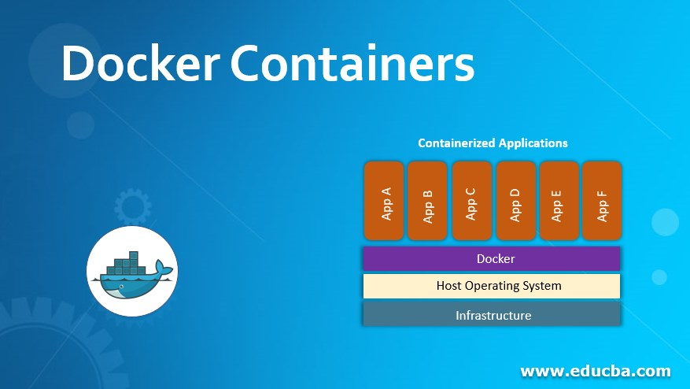

  
  
```{r, include=FALSE,warning=FALSE,message=FALSE}
options(htmltools.dir.version = FALSE)
knitr::opts_chunk$set(
  message = FALSE,
  warning = FALSE,
  dev = "svg",
  fig.align = "center",
  #fig.width = 11,
  #fig.height = 5
  cache = TRUE
)

# define vars
om = par("mar")
lowtop = c(om[1],om[2],0.1,om[4])
library(tidyverse)
library(knitr)
options(dplyr.print_min = 5)
set.seed(10)
```


# Docker Containers

Docker - a 'container' to easily transport your code/program to others  

- Includes all relevant files (specific python install, specific packages, etc.)  

- No chance of surprise bugs!

```{r, echo = FALSE, fig.align = "center", out.width = "550px"}

```

---

# Docker Containers

Run on a linux kernel

- `Dockerfile` specifies how to build a docker **image** 

- Once built, you can run or deploy the image, creating a container

```{r, echo = FALSE, fig.align = "center", out.width = "550px"}
knitr::include_graphics("img/build_docker.png")
```


---

# Docker 

Suppose we want to build our own image!

- Need to create a `Dockerfile` telling Docker how to build our image


---

# Docker 

Suppose we want to build our own image!

- Need to create a `Dockerfile` telling Docker how to build our image

Let's create our API as a docker image

- First, create a directory for the relevant files/scripts

- Second, create a file called `Dockerfile` (no file extension) in that folder


---

# Dockerfile

Describes how to build the image   

`FROM rstudio/plumber`  

`RUN apt-get update -qq && apt-get install -y  libssl-dev  libcurl4-gnutls-dev  libpng-dev libpng-dev pandoc`  

`RUN R -e "install.packages(c('GGally', 'leaflet', 'plumber'))"`  

`COPY myAPI.R myAPI.R`  

`EXPOSE 8000`  

`ENTRYPOINT ["R", "-e", \`  
`    "pr <- plumber::plumb('myAPI.R'); pr$run(host='0.0.0.0', port=8000)"]`  
 

---

# Build the Image  

We now build the image 

- Change your terminal's working directory to your folder with the dockerfile

Now build it:  `docker build -t api .`

- `build` is telling docker we want to create an image

- `-t` indicates we are providing a name  

- `api` is the name, `.` implies we are in the directory we want to build from


---

# Run the Container  

Now we have the image, we use `docker run` to start it up!  

`docker run --rm -p 8000:8000 api`

- `--rm` says remove the image when done  

- `-p` gives docker access to our port  

- `8000:8000` ports available to use (only 8000)

- `api` name of the image to run  

---

# Other Things to Note

Should make sure things aren't still running once we stop using it 

- `docker container ls` shows what containers are running  

- `docker kill __name__` stops them  

Can delete a container with `docker rm`  

- `docker rm NAME`  

When rebuilding, sometimes you don't want to use the cached builds

- `docker build -t NAME --no-cache`  

Can export container with `docker export` (or image with `docker save`)!  

- `docker export CONTAINER_NAME path.tar`  

Can remove images with `docker rmi`

- `docker rmi -f ID`  


---

# Recap

- We can build our own images!

- Create a `Dockerfile` and instruct it on what to do

- Need to Google some linux commands and do some troubleshooting!